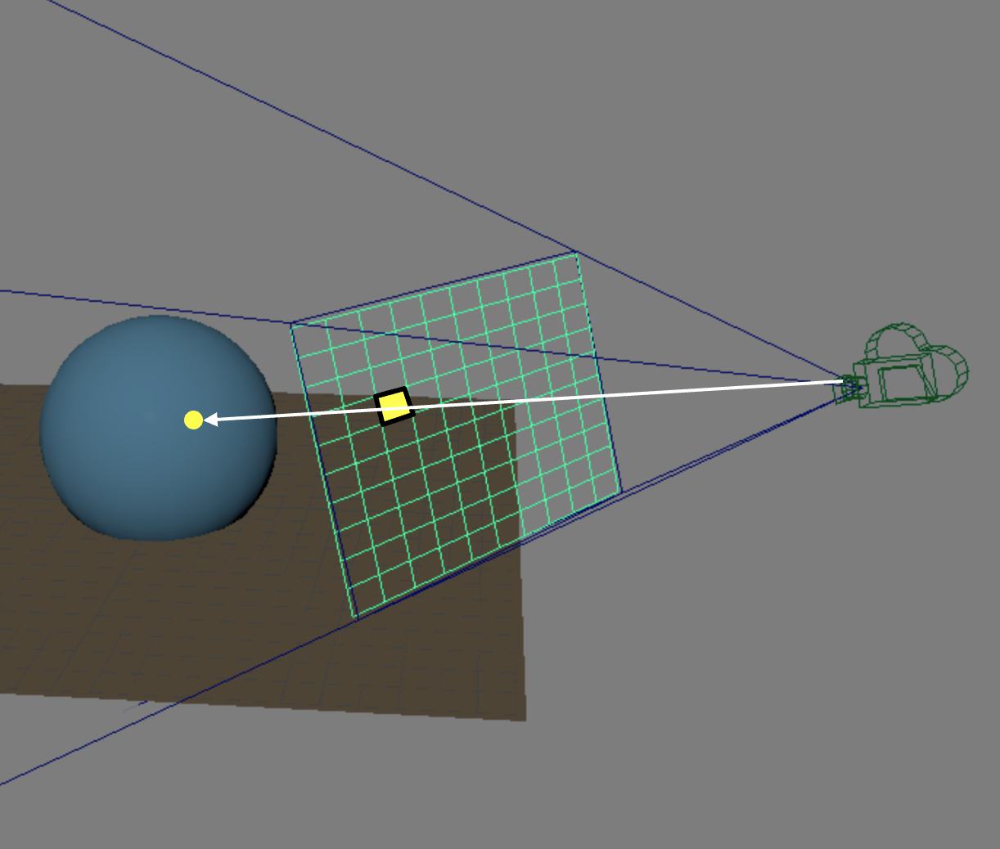
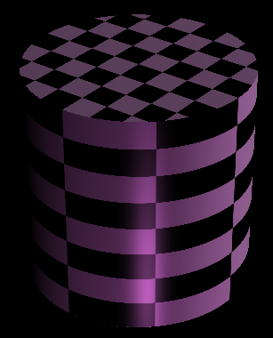
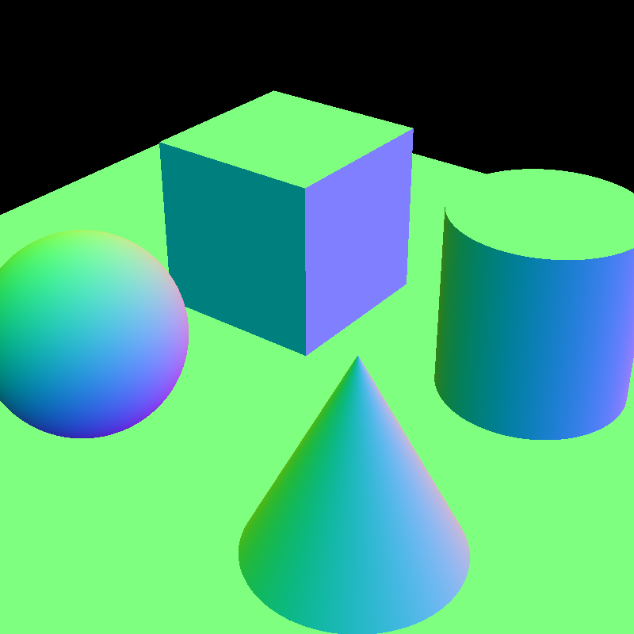
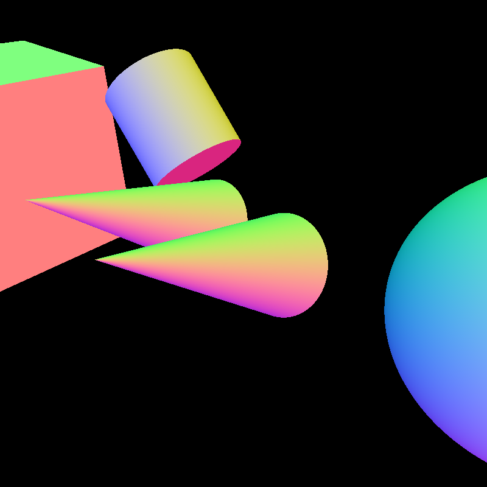
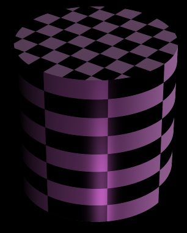

<!--
 * @FilePath: \projects_ray\docs\ray_1\README.md
 * @Author: AceSix
 * @Date: 2022-07-08 21:25:24
 * @LastEditors: AceSix
 * @LastEditTime: 2022-07-08 21:39:22
 * Copyright (C) 2022 Brown U. All rights reserved.
-->
# Projects 3: Ray

### Introduction to Computer Graphics, Fall 2022

*Due:*

## 1 Introduction

In this assignment, you will implement the **basic part** of your ray tracer, an intersection check pipeline that simulates how ray bounces in a scene. 

The following diagram shows an example of one ray shooting through a pixel on the viewplane and intersecting with a sphere in the scene. You ultimate goal of this assignment is to implement this process with the given scene data.

    
    <figcaption align = "center"> <b>Fig. 1</b> 
    Casting ray from camera
    </figcaption>

## 2 Requirements

This assignment is out of 100 points

* Parsing the scene **(5pts)**
* Casting ray from camera **(10pts)**
* Intersection check pipeline **(35pts)**
* Four shape primitives (implicit functions and normals) **(20pts)**:
  * Cube **(5pts)**
  * Sphere **(5pts)**
  * Cylinder **(10pts)**
  * Cone **(10pts)**
* Efficiency **(15pts)**
* Software Engineering & Stability **(10pts)**
* README **(5pts)**

### 2.0 Parsing the scene

You are going to use the same scenefile from the parser lab to describe a scene. For your ray tracer, you will load the scene from a scenefile, parse it, and then render the scene with the ray tracing algorithm. 

Hence, first thing first, you need to be able to correctly parse the scene, which you have already completed in the parsing lab. **If you haven't, please make sure you finish the parsing lab first before working on the ray project.**

Please refer to section 3.1 on where to implement the parser.

### 2.1 Generating and casting rays

In order to generate and cast rays into the scene, you will need to shoot rays through a pixel on the viewplane. For basic requirements, **you are only required to shoot one ray through the center of each pixel**.

You may notice that your outputs have "jaggies" on edges like the image shown below. These are aliasing and due to the low sampling rate, so don't worry! Check out the extra credit section if you are interested in exploring ways to resolve them!

  
  <figcaption align = "center"> <b>Fig. 2</b> 
  baseline output and MSAA output
  </figcaption>

### 2.2 Finding intersection point

In order to find an intersection point, we first have to define our shapes. As covered in lectures, we are going to use implicit functions to define our shapes. You are required to be able to correctly handle 4 shapes using implicit functions in total.

For all implicit shapes, you can assume that their center all **sit at the origin** and can fit into a **unit cube**. 

- Cube: 
  Since we want to have a cube in a unit cube, then we just have to make all its sides have a length of 1.
- Cone:
  The bottom cap of the cone should have a radius of 0.5.
- Cylinder:
  Both the top and bottom caps of the cylinder should have a radius of 0.5.
- Sphere:
  The radius of the sphere should be 0.5

### 2.3 Getting normals and use them for “Illumination”

In this assignment, you are not required to handle any lighting. Yet, it would still be nice to be able to distinguish between different primitives in the scene and verify the implementation. 

For the scope of this assignment, **color the pixel with the WORLD SPACE normal of the primitive at the intersection point**. You may have noticed that the value of normal ranges from -1 to 1, but RGB color only ranges from 0 to 1. Hence, a mapping is required to convert the value. You can refer to the answer to Question 4.2 in the ray 1 ALGO for the correct mapping.

### 2.4 Results

Here are some sample images of what your ray tracer should be capable to render by the end of this assignment.

  

    
    
    
    <figcaption align = "center"> <b>Fig. 4</b> 
    Sample outputs
    </figcaption>
  

## 3 Project Stencil

### 3.1 Codebase

For this assignment, we are going to use the command line interface rather than the UI interface. The stencil reads from a config file and perform the parameter parsing. 

This config file is called `QSettings` and it has the extension of `.ini`. There is a sample config file in the `config` directory. You can take a look at `main.cpp` to figure out how the config file is parsed. 

The codebase is structured with three modules.

- The `utils` module provides the utilities you will use for the ray tracer. 
  - You should implement the `SceneParser` as you have done similarly in the parsing lab.

- The `camera` module contains everything related to camera operation. 
  - The `Camera.h` defines an interface for the camera. It provides everything you may need for this assignment.
  - You should have your own camera implementation that conforms to this interface.

- The `raytracer` module is the main component of this assignment. You will write the majority of your code here.
  - In `RayTraceScene`, you will construct the scene using the `RenderData` you filled in the `SceneParser`
  - In `RayTracer`, You will implement the ray tracing algorithm. It takes in a `RayTracerConfig` during initialization.
  - The `RayTracerConfig` is a struct that contains various flags to enable or disable certain features.

As mentioned in the general handout, you have the freedom to add any class you think that is necessary for this assignment. But please do keep the existing interface intact, because the TAs are relying on the interface to grade your assignment.

You may notice that the stencil already has some existing config parameters. Some of them are for the next assignments, others are for optional extra credits. However, if you feel like implementing an extra feature that is not included in the existing config parameters, feel free to add the new parameter to your `.ini` file and the `RayTracerConfig`. You may also want to document this change in your README to help TA with grading.

### 3.2 Design

Please do keep in mind that you are only implementing parts of your ray tracer, and you will keep working in the same repo in the next assignment. 

When making your design choices, think a bit further about what could be needed in the next assignment, and whether your design provides the flexibility for you to easily extend its feature. 

You can take a look at the handout for the next assignment to get some idea on what are the expectations.

To roughly sum it up, you are required to implement texture mapping, different light sources, and phong lighting model with shadow and reflection in your next assignment.

## 4 Extra Credits

* **Acceleration data structure**: There are various ways to build an acceleration data structure. Here are the approaches that are covered in the lecture.
    * Octree
    * BVH
    * KD-Tree
* **Parallelization**: There are many ways to parallelize your code. It can be as simple as one line of code in OpenMP. It can also go up to a carefully designed task scheduler that acts like Cinebench. Evidently, the grades you receive will be based on the complexity of your implementation. If you have more questions on the rubric and design choice, come to TA hours and we are happy to help. 
* **Anti-aliasing**: As we are only shooting one ray through the center of each pixel, it can be expected that there will be aliasing. In your filter project, you’ve learnt some ways to fix aliasing as a post-processing approach. Try to figure out if you can integrate your filter into your ray tracer as a post-processing module for your output image.
*  **Super-sampling**: As mentioned above, the source of aliasing is the low number of samples. So the most direct way to resolve it is to increase the number of samples. Here are a few ways to do super-sampling.
    * Naive super-sampling
    * Adaptive super-sampling
    * A quick comparison between baseline and super-sampling
      

        
        
        <figcaption align = "center"> <b>Fig. 2</b> 
        baseline output and MSAA output
        </figcaption>
      

## 5 README

You must submit a README in Markdown format. This file should contain basic information about your design choices. You should also include any known bugs or any extra credits you’ve implemented. 

For extra credits, please describe what you've done and roughly point out the related code segment. If you implement any extra feature that requires you to add a parameter for the QSettings and the `RayTracerConfig`, please also document it accordingly so that the TAs won't miss anything when grading your assignment.

Please note that the README is worth **5 points** of your assignment grade!

## 6 Handling in

To submit your assignment, upload your repo to Gradescope via Github. For all assignments in this course, we will test your code on department machines, so we expect your code to be able to compile on department machines. If you are developing locally, please test your code before submitting. If your code does not compile, we will ask you to resubmit and this will result in a late penalty!

## 7 FAQ & Hints

### 7.1 Nothing shows up

Start with a simple scene, like the scene with only one primitive and make sure it’s working.

Think thoroughly about the whole ray tracing pipeline before start writing your code. What are the transformations needed to compute the final output? Does your math and number make sense? Is there any negative value or extremely large value during the computation?

Utilize the QtCreator debugger to debug.

### 7.2 My ray tracer runs extremely slow :(

Since the time complexity of the naive ray tracing algorithm is $O(MN)$, where M is the number of pixels and N is the number of primitives, it inevitably is going to be slow when the number of primitives in the scene gets large. 

But that’s not the end of the world and here are some tips for you at different stages.

**When you are still working on your project:**

Typically, modern CPUs should have enough horsepower to handle most of our scenes. Yet, you still definitely want to render your scene in a flash to check for bugs and errors. 

One thing you can do is to limit the resolution of your output image. Our default rendering resolution is $800\times800$, but you can reduce it by half or even more. And of course, you don’t want to start with any extremely complex scene. Here is the list of complex scenes that you should be aware of.

- List of complex scenes

Despite these scenes being complex, it does not mean that we are not going to test them on your ray tracer for grading. You are still expected to output reasonable results on these scenes in a reasonable amount of time.

**When you have finished the basic requirements and are looking for more:**

As covered in the lecture, ray tracing is ‘embarrassingly parallel’. Therefore, you can boost your performance simply by making your ray tracer parallel. And there are tons of ways to achieve this. Please refer to the extra credits section for more information.

It’s worth noting that acceleration data structure also offers **significant** performance boost. And there are plenty of choices for you.

If you are registered for the half-credit, it is strongly recommended that you do both for the requirement.
