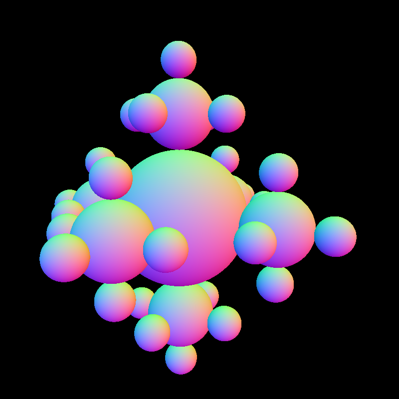

# Algo 3: Ray

### Introduction to Computer Graphics, Fall 2022

*Due:*

## 1 Camera operation

When implementing the ray tracing algorithm, it would be common that you will need to transform between different coordinate spaces. One transformation would be between the camera space and the world space. 

We are going to use the following term term for the rest of our course.

- **Camera's view matrix**: The matrix that transform **from world space to camera space**.

Now, given the position, look vector, and up vector, how would you use these info to compute the camera's view matrix? **You are not required to write any detailed math equation, just talk about what should be computed in order to get the camera's view matrix.**

## 2 Generating rays

**[2 points]2.1** Given the following info of a pixel in an image, calculate the corresponding point on the view plane. You can assume that the pixel (0, 0) corresponds to the top left pixel of the image.

* $W$: image width
* $H$: image height
* $i$: pixel row index
* $j$: pixel column index
* $k$: depth of the view plane from camera position
* $\theta_h$: horizontal view angle
* $\theta_v$: vertical view angle

For the purpose of the algo, you will use k to express the depth of the view plane from camera position. But when actually doing your coding, this value can be arbitrary and you can set it to 1. Try to think about why this is the case.

The following diagram demonstrate what the view plane is.

    
    <figcaption align = "center"> <b>Fig. 1</b> 
    Viewplane example
    </figcaption>

**[1 points]2.2** Given the position of your camera $p_{eye}$ and a point on the view plane $p_{view}$ in the camera space, write down the equation for the ray you want to cast into the scene. Specify your ray in the format $p + td$, where $p$ is the origin point and $d$ is a normalized vector.

## 3 Implicit shape primitives

**[3 points for the cone body(3.1), 2 points for the cone cap(3.2)]**

For the purpose of the Ray assignment, you can assume that **all of the shape primitives have the size of a unit cube with its center at the origin**. For example, if you are dealing with a sphere, then its radius will be $0.5$ and its center is placed at the origin.

**Write out both of the intersection equations for the cone body and the cone bottom cap.**

**Your final answer should be something like $t = ...$, that specify how to calculate t for intersection with an arbitrary ray shooting from $p$ in the direction of $d$. You can leave your intermidiate results, but make sure you highlight your final answer by either circling or boxing them.** 

Hints: Recall how we define the cylinder in lectures and think about how we should do that for the hat of the cone.

Hints: The intersection points you compute are only possible intersection points, because they must fit certain criteria to be considered for true intersection points (such as the $−0.5 ≤ y ≤ 0.5$ restriction for the body of the cylinder in the lecture notes). In your actual code implementation, you should correct handle this and rule out those cases, however for this algo problem you are **NOT** required to list these restrictions. 

## 4 Illuminating samples

**[2 points]4.1** In the first part of the ray project, you are **NOT** required to handle any lighting. Instead, you will only need to use the **WORLD SPACE NORMAL** at the intersection point as its color. Therefore, you have to compute the normal correctly! 

Given the following values, write down the equation for the normal vector $\vec{n_w}$ in world-space

- $\vec{n_o}$ : normal vector in object-space. 
- $M$ : object’s modeling transformation  

**[2 points]4.2** Now you have the normal in the world space, it's time for you to set it as the final color, but there is one more thing to do. Since RGB color only range from 0 to 1, and normal value ranges between -1 and 1, it has to be mapped correctly.

Write down a way to linearly map the values from normal value to RGB value.

If you do the above computation correctly in your project, you should see something like this on a sphere.

    
    <figcaption align = "center"> <b>Fig. 2</b> 
    Spheres with normal color
    </figcaption>

