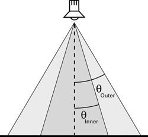
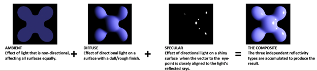
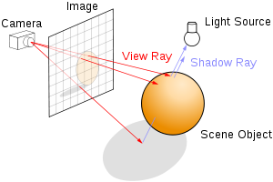
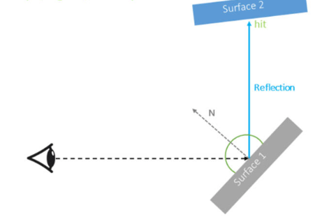

<!--
 * @FilePath: \docs\ray_2\README.md
 * @Author: AceSix
 * @Date: 2022-07-08 21:38:18
 * @LastEditors: AceSix
 * @LastEditTime: 2022-07-24 13:05:32
 * Copyright (C) 2022 Brown U. All rights reserved.
-->
# Projects 4: Ray 2

### Introduction to Computer Graphics, Fall 2022

*Due:*

## 1 Introduction
In the previous project,  you saw a glimpse of the powers of raytracing algorithms. But the images rendered by the current program are simple and plain. There is so much more for you to discover! You will learn to create light and shade patterns, model shiny surfaces, add texture mapping, etc. There are countless amazing features for you to discover.

## 2 Requirements

For this project you will need to implement the following features that extend the functions you achieved in ray 1 project. Below are the points for each required feature out of a total of 100 points.
* Point light **(3pt)**
* Directional light **(5pt)**
* Spot light **(5pt)**
* Diffuse **(5pt)**
* Specular **(6pt)**
* Attenuation **(6pt)**
* Reflection **(10pt)**
* Shadow **(10pt)**
* Texture mapping **(10pt)**
* Code design **(15pt)**
* Stability **(15pt)**
* Efficiency **(5pt)**
* Readme **(5pt)**

### 2.0 Light sources
To start with, you are required to implement the interaction between objects and light sources in the scene correctly. Three types of light sources are required: **point light**, **directional light** and **spot light**. All light sources are parsed from scene files we provide. Each light source has light intensity values and its own specific parameters. Point light and spot light also have attenuation coefficients.

#### 2.0.1 point light
Point light is an infinitesimal point in space that emits light equally in all directions. You can understand its characteristics by imagining a light bulb whose volume is condensed to a single point. This light source’s specific parameter is its *position*.

#### 2.0.2 directional light
Directional light is a light that shines in a particular direction. It does not have an explicit source. Directional lights are helpful to simulate the light coming from very far away, like sunshine. This light source’s specific parameter is its *direction*.

#### 2.0.3 spot light
Spot light is a point in space that emits light in a finite cone of directions. A good example of spot light in real life is a flashlight. A region with the shape of a cone is able to receive light from the spotlight source. 

In this project, you are required to implement spotlight with falloff. Falloff is the effect of light intensity becoming weaker since a certain point. The boundary of whole region lighted by the spotlight is called an outer cone. Within the outer cone there is a smaller region where light intensity is full, the boundary of this region is called an inner cone. For the region between inner and outer cone, the light intensity gradually gets lower as the distance from the inner cone increases. 

    
    <figcaption align = "center"> 
    Spotlight with its inner and outer cone.
    </figcaption>

$$
    f(x)= 
\begin{cases}
    I_{full},& \text{if } x\leq \theta_{inner}\\
    I_{full}\cdot(1 - \text{falloff}(x)),   & \theta_{inner} < x \leq\theta_{inner}
\end{cases}
$$

There are many different falloff functions with different effect. Here we choose a function with smooth transition effect at the boundaries:
$$\text{falloff}(x) = -2*(\frac{x-\theta_{inner}}{\theta_{outer}-\theta_{inner}})^3 + 3*(\frac{x-\theta_{inner}}{\theta_{outer}-\theta_{inner}})^2$$

This light source’s specific parameters include its *position*, *direction*, *angle*(_angle of outer cone_) and *pnumbra*(_angle between inner and outer cone_).

### 2.1 Phong Lighting Model
The phong lighting model is one of the many lighting models to create realistic lighting effects by simulating real world light physics. It views the overall lighting as the combination of three components: ambient, diffuse and specular.

    
    <figcaption align = "center"> <b>Fig. 1</b> 
    Phong lighting effect
    </figcaption>

In the previous project you have finished the ambient lighting component. Ambient lighting is concerned with the environmental light that applies to everywhere equally. Diffuse and specular lighting work differently. They require you to track the interaction between intersection points and light sources in the scene.

$$
I_{\lambda}=k_{a}O_{a\lambda}
+\sum_{i=1}^{m}f_{att}I_{\lambda,i}\left[k_{d}O_{d\lambda}({\bf\hat{N}}\cdot{\bf\hat{L}_{i}})
+k_{s}O_{s\lambda}({\bf\hat{R}_{i}}\cdot{\bf\hat{V}})^{n}\right]
$$

You are required to implement the *diffuse* lighting, *specular* lighting and *attenuation* based on the equation above. Here, the subscripts a, d and s stand for ambient, diffuse and specular, respectively.

- $I$ is the intensity of the light (or for our purposes,you can just think of it as the color).
- $\lambda$ is the subscript for each wavelength (red,green, and blue).
- $k$ is a constant coefficient. For example, $k_{a}$ isthe ambient coefficient.
- $O$ is the color of the object being hit by the ray. Forexample, $O_{d\lambda}$ is the diffuse color at the pointof ray intersection on the object.
- $m$ is the number of lights and i is the index for eachlight.
- $I_{\lambda\,i}$: is the intensity of light i.
- ${\bf\hat{N}}$: is the normalized normal on the objectat the point of intersection.
- ${\bf\hat{L}_{i}}$: is the normalized vector from theintersection to light i.
- ${\bf\hat{R}_{i}}$: is the normalized, reflected lightvector from light i
- $f_{att}$: is the attenuation factor
- ${\bf\hat{V}}$: is the normalized line of sight vector
- n: is the specular exponent (or shininess)

The *attenuation* factor should be calculated according to the equation below. C1, c2, c3 are attenuation coefficients that are given in the scene files

$$
f_{att} = min(1, \frac{1}{c_1 + distance*c_2 + distance^2*c_3})
$$

### 2.2 Shadows
*Shadow* is a common phenomenon in our everyday lives. It happens when part of an object is blocked from the light source by other objects. In this project, you are required to take shadow into account when implementing lighting.

    
    <figcaption align = "center"> <b>Fig. 2</b> 
    shadow mechanism
    </figcaption>

The key to adding shadow is to judge whether a light source can really affect the intersection point. For the basic requirement, the shadow part just ignores the effect of blocked light sources directly. But be careful to take the characteristics of different types of light sources into account. 

The basic requirement is just a simple way to create shadows. You may discover more interesting ways to add shadows in extra credit.

### 2.3 Reflection
*Reflection* happens on smooth, metallic surfaces(like a mirror). It allows you to see in the direction of the reflection of your eyesight. The existence of reflection relies on the surface material. In this project you are required to implement reflection using recursive sampling for and only for specific materials.

    
    <figcaption align = "center"> <b>Fig. 2</b> 
    reflection mechanism
    </figcaption>

It is possible to encounter the situation of having multiple times of reflection. You are required to limit the maximum depth of reflection to 3.

<!-- TODO: the introduction of fresnel ratio may be a simple addition. Just to specify a weight coefficient for reflection light -->

### 2.4 Texture mapping
*Texture mapping* is the introduction of texture intensity when calculating the diffuse part of phong lighting model. Generally speaking, it is to replace part of the surface intensity with the color of texture images.

#### 2.4.1 uv coordinate
An important aspect for texture mapping is the uv coordinate. It solves the problem of where a pixel in texture image should be on the surface of that texture. When you create a surface of a shape(it may be the whole surface of a sphere or one face of a cube), each point on that surface is assigned a 3D coordinate indicating its location in the scene. For texture mapping, you also need to give each point a 2D uv coordinate. And each surface should have its own uv coordinate system. For example, on each face of a cube the uv coordinate system may originate from the left top corner and use left and top edge as axis. You should think about how that applies to other shapes on your own. With uv coordinate system, you can design a mapping from image pixel coordinates (row, column) to uv coordinates.

#### 2.4.2 blending
Another aspect of texture mapping is how the texture image replace the surface’s original color. A "blend" value is supplied as a material property for objects that are texture mapped. If the blend value is 1, then the texture entirely replaces the diffuse color of the object. If the blend value is 0, then the texture will be invisible. If the blend value is between 0 and 1, then you should perform linear interpolation in the same fashion as the flow rate in Brush.

The texture images in the scenefiles are specified by absolute paths on the department file system. If you are working on the project locally, then you must change the texture paths in the scenefiles so that they are absolute paths to the textures on your local file system. All of the scenefiles and textures are in the data repo.

#### 2.4.3 implementation
In this project, we require you to load textures and apply to objects with correct uv mapping and blending. Relative parameters and object properties can be found in scene files or by reading the stencil codes. For the required feature, you only need to use nearest-neighbor sampling for getting color from texture images. Though more complex algorighms can be used for extra features. (You will learn more about this later.)

## 3. Codebase & Design

You will work completely on the basis of your ray 1 project. There will not be any additional code base for this project rather than what is already there in ray 1. We have provided the data structures for object material and light sources, which you may already have noticed. They contain the necessary information you need to implement the phong model and other required features. You will find those structures along with their detailed explanation in TOOD: which files

As before, the structure of this project is solely up to you. Make any necessary arrangements for the files but you are not allowed to alter any preset command line interfaces we have implemented in the code base.

For some basic scenes, we give you some examples with the expected effect in TOOD: which folder. They serve as reference for you to check the correctness of your implementation.

## 4. FAQ & Hints
### 4.1 My scene color looks different from the demo.
The color from lighting is affected by many factors. Surface normals, object materials, light sources, global coefficients, etc.

You can try to validate the correctness of most factors by setting breakpoints and checking intermediate variables. They ought to behave in the way you expect them to. Some factors like light sources and normals may be a bit difficult. You can validate them with manually calculated values in the simplest scenes like cube and spheres.

Debugging can be hard. Be patient and creative!

### 4.2 My ray tracer runs extremely slow :(
In ray 2 there might be more problems that slow down your ray tracer. You should first check for endless looping. After ruling out that, there is the possibility of inefficient operation or less powerful computing devices. We provide many parallel computing methods that may help.

## 5. Extra Credits

* **Acceleration data structure**: There are various ways to build an acceleration data structure. Here are the approaches that are covered in the lecture.
    * Octree
    * BVH
    * KD-Tree
* **Parallelization**: There are many ways to parallelize your code. It can be as simple as one line of code in OpenMP. It can also go up to a carefully designed task scheduler that acts like Cinebench. Evidently, the grades you receive will be based on the complexity of your implementation. If you have more questions on the rubric and design choice, come to TA hours and we are happy to help. 
* **Anti-aliasing**: As we are only shooting one ray through the center of each pixel, it can be expected that there will be aliasing. In your filter project, you’ve learnt some ways to fix aliasing as a post-processing approach. Try to figure out if you can integrate your filter into your ray tracer as a post-processing module for your output image.
* **Super-sampling**: As mentioned above, the source of aliasing is the low number of samples. So the most direct way to resolve it is to increase the number of samples. Here are a few ways to do super-sampling.
    * Naive super-sampling
    * Adaptive super-sampling
* **Texture filtering**: In the 2.4 we talk about the nearest-neighor filtering as the basic requirement. But this method generates unsatisfying results when texture image resolution and surface size(shown in the image) are very different in scales. You can use more advanced filtering methods to interpolate the colors. For example:
    * Bilinear filtering
    * Trilinear filtering
* **Refraction**: Similar to reflection, refraction is another light effect that alters the direction of light ray. The actual modeling of refraction can be very difficult. The efficent computation of refraction effect is still being persued by researchers. For this extra credit you only have to model simple refraction effect. You can assume camera ray will go through one or more refraction objects before hitting a surface whose lighting can be calculated directly. You DON'T have to worry about the light shined on solid object after being reflected/refracted in the scene. (You can try. But it would be very difficult and time consuming.)
* **Depth of field**: The basic implementation of our ray tracing method actually uses an perfect pin hole camera. It features the idea situation where each point in the screen is affected by exactly one ray of light. But a real world lens camera is looking through a lens. So the focus of objects in the scene varies with its distance from the camera.

