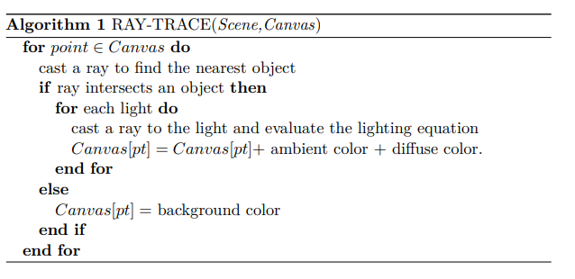
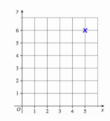
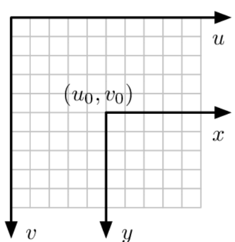

<!--
 * @FilePath: \projects_ray\docs\ray_2\algo.md
 * @Author: AceSix
 * @Date: 2022-07-15 20:51:22
 * @LastEditors: AceSix
 * @LastEditTime: 2022-07-15 23:16:29
 * Copyright (C) 2022 Brown U. All rights reserved.
-->
# Algo 4: Light

### Introduction to Computer Graphics, Fall 2022

*Due:*

### 1 Lighting calculation

**1.1 Lighting components** In the following ingredients, select out which ones are used for which part of lighting calculation. (Suppose you already acquire the intersection position. And ingredient 1 and 2 are only for the intersection surface.)

*Ingedients:*
* (1) Surface normals
* (2) Surface color
* (3) Light sources
* (4) Camera position

*Lighting components:*
* (a) Ambient Light
* (b) Diffuse
* (c) Specular
* (d) Reflection
* (e) Texture mapping

**2.2 Raytracing pipeline** In the following pseudo code, what needs to be changed / added to make this a full-fledged raytracer?

    

### 2 Reflection equation
Calculating the reflected direction of light on surface is an important part of implementing lighting. Given the light direction L, normal N, write down the function for getting reflection direction. (L is from light source to intersection point)

### 3 Texture coordinates
In most cases, your shape’s texture coordinates may have different coordinates than the texture images. In the case below, surface coordinates originates from left bottom while the texture image from left top. In order to make the image show on the surface without any change in orientation, you need to build a mapping between these two coordinate systems.

    
    

**3.1** Suppose image has a size of (w, h) and surface has a size of (s, t). What’s the location of a pixel (u, v) on the surface when the texture image covers the whole image?

  

**3.2** From question 1. Suppose that you want to repeat the texture m times horizontally and n times vertically. What’s the location of pixel (u, v) on the surface now? (Multiple positions, express in a way you feel best!)

### 4 Shadow generation
In the normal process of adding shadows, you need to do the intersection again in the scene from the previous intersection point. Here is the problem, do you have to detect intersections with the previous intersected object itself? Why?

### 5 Falloff function
Falloff is the effect of lighting intersity gradually fading from center to boundary. Think about the case of a spot light. To make it simple, we set the spot light to falloff right from the center. We use a falloff function to calculate the magnitude of falloff. It works like this:

$$
I_f(x) = I*(1 - \mathcal{F}(x, b))
$$

where $I$ is the full light intensity, $I_f$ is the light intensity after applying falloff, $\mathcal{F}$ is the falloff function, x is current position from center and b is boundary position.

Although any falloff function is allowed, we typically want a function range from 0 to 1 and is smooth at the boundaries. With this standard, which falloff function below do you think is best?

* (a) $\mathcal{F}(x,b) = \sin{(\frac{x}{b}*0.5\pi)}$
* (b) $\mathcal{F}(x,b) = \frac{x}{b}$
* (c) $\mathcal{F}(x,b) = -2*(\frac{x}{b})^3 + 3*(\frac{x}{b})^2$
* (d) $\mathcal{F}(x,b) = 0.5*\cos{(\frac{x}{b}*\pi)}+0.5$

